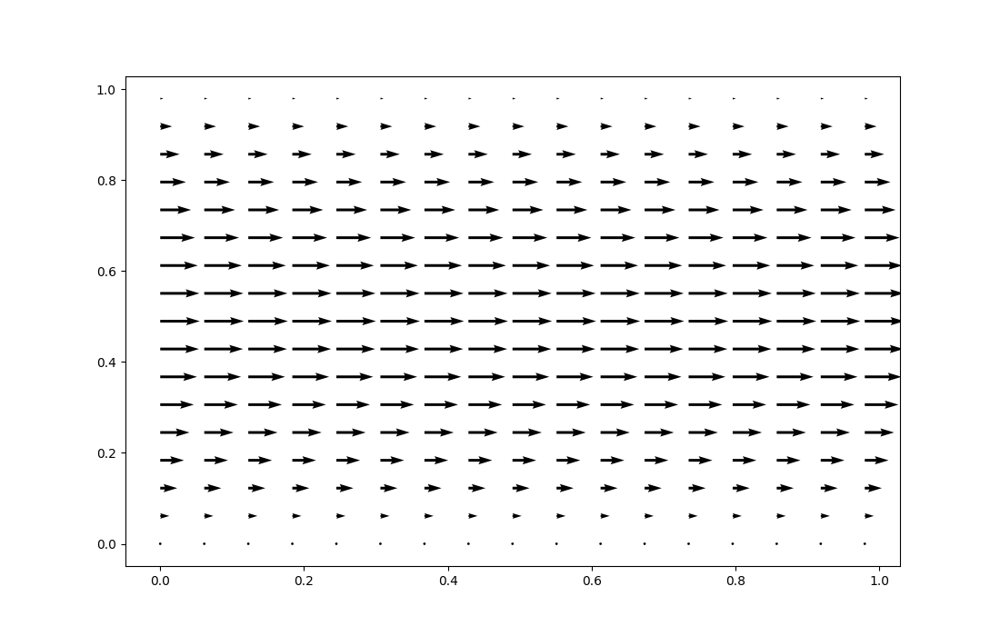
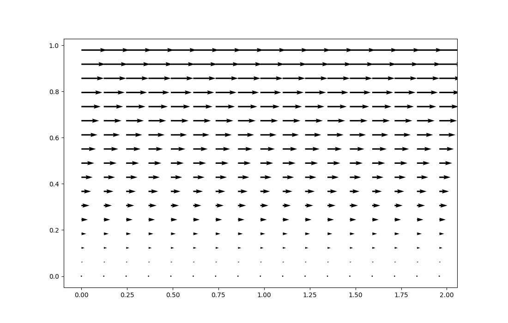

[](https://www.python.org/)

[](https://github.com/sandialabs/sibl#license)

[](https://codecov.io/gh/mlanduyt/Final_Project)
[](https://github.com/mlanduyt/Final_Project/actions)


### Getting Started

### Conda environment & installation <a name="install"></a>

To install this package, please begin by setting up a conda environment:
```bash
conda create --name XXX-method-env python=3.12
```
Once the environment has been created, activate it:

```bash
conda activate XXX-method-env
```
Double check that python is version 3.12 in the environment:
```bash
python --version
```
install the applicable pips utilized for this code
```bash
pip install -e .
```

### Background
This code is designed to operate as a simple computational fluid dynamics solver. This simple solver uses the differential form of the navier stokes equation to step through fluid dynamics and solve for the expected flow response. The solver is used to calculate poiseuille and couette flow; and compared to expected analytical results. 

### Applied Skills
The following are skills from ME700 which are utilized within this project, these points are taken from the learning objectives listed in the ME700 syllabus:

Analyze and solve problems involving nonlinearity
Develop numerical solution strategies to nonlinear problems, including appropriate iteration schemes

1) Write, test, and debug Python programs for computational mechanics applications using
modern development tools and practices

2) Apply test-driven development principles to create reliable and maintainable scientific computing code

3) Use version control effectively with Git and GitHub for code management

4) Implement proper documentation practices using Markdown and inline code documentation

5) Evaluate and contribute to open-source scientific software projects in a professional manner

6) Design and implement comprehensive solutions that integrate mechanical theory with practical software implementation

7) Develop and execute verification and validation strategies for computational mechanics implementations

8) Complete an independent project that demonstrates mastery of both technical concepts and
software development practices


### Examples/Template
The tutorials provided evaluate fundamental pipe flow equations. The applicable navier stokes equations are described in each tutorial. Three tutorials are provided; poiseulle flow, couette flow, and a bonus flow. Each are described in more detail below. 

## Poiseuille Flow
This flow in a pipe is driven by a pressure difference between each ends. Each wall provides a no-slip boundary condition, generating a flow as seen below: 



## Couette Flow
This flow in a 'pipe' represents an analogy to a simple boundary layer, in which the bulk flow is simplified to a moving wall. This flow is evaluated as if a pipe existed with a no-slip motionless wall and a no-slip moving wall at some velocity. This flow is seen below:



## Bonus Flow
This flow evaluates an imparted vertical velocity progressing through each time step. This flow is merely to showcase time steps and the result of an unusual flow case. Therefore, the comparison to analytical results are not performed. 

### Tests
Tests are executed via the Pytest function, tests are executed automatically. Code coverage is provided. 

